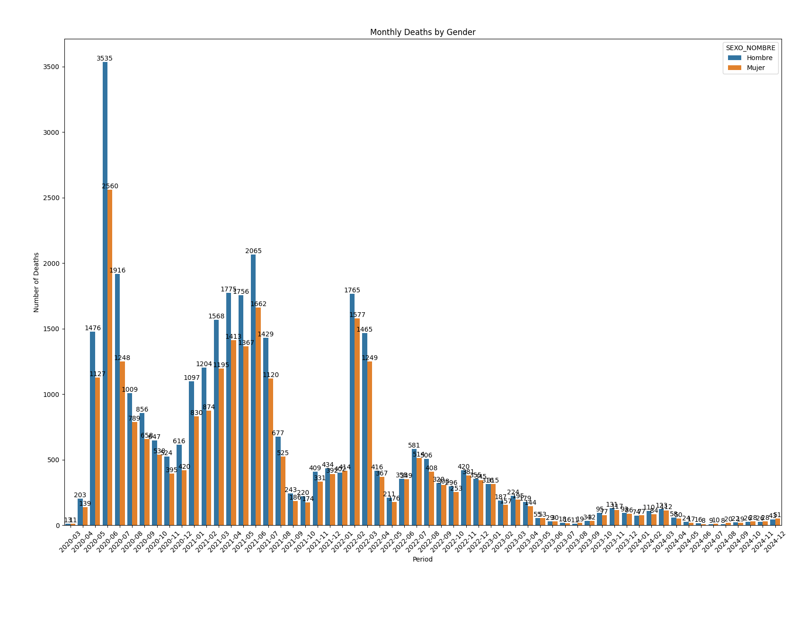
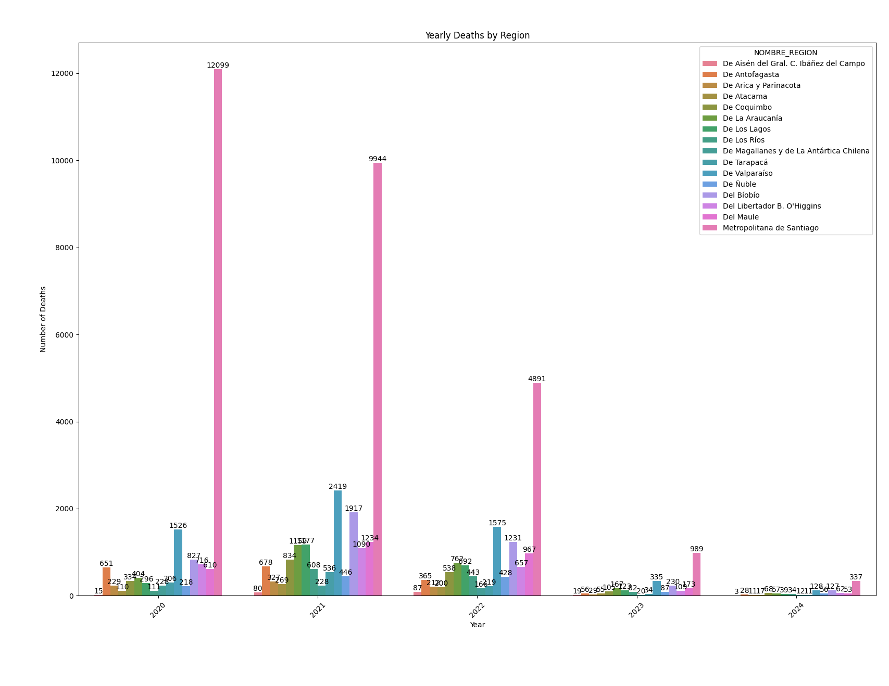
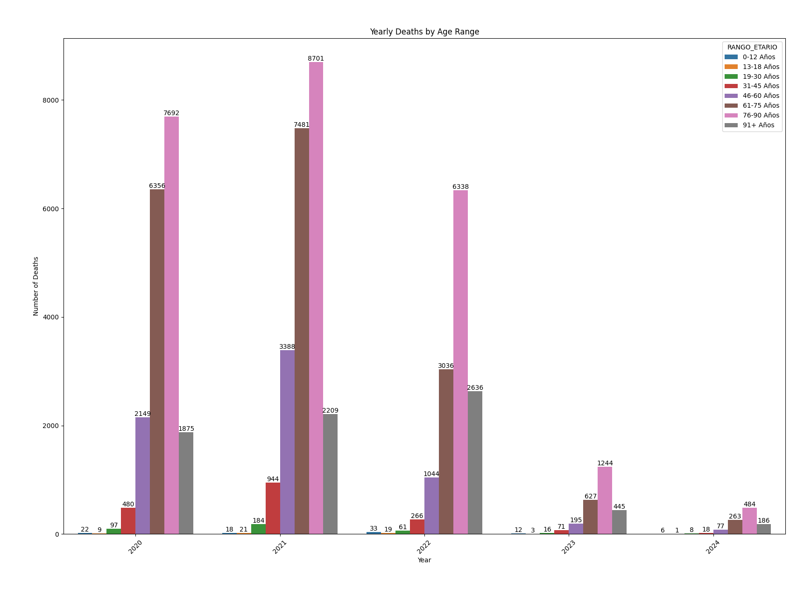
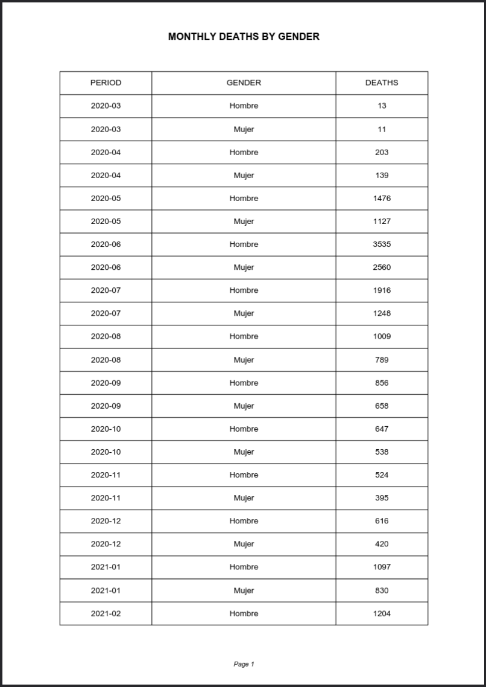
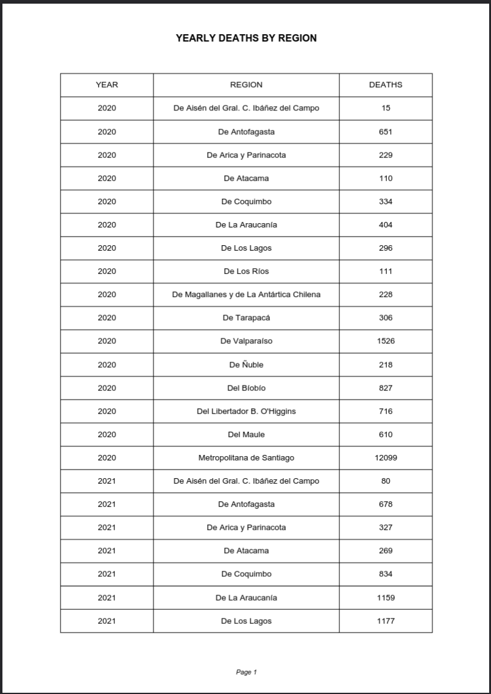
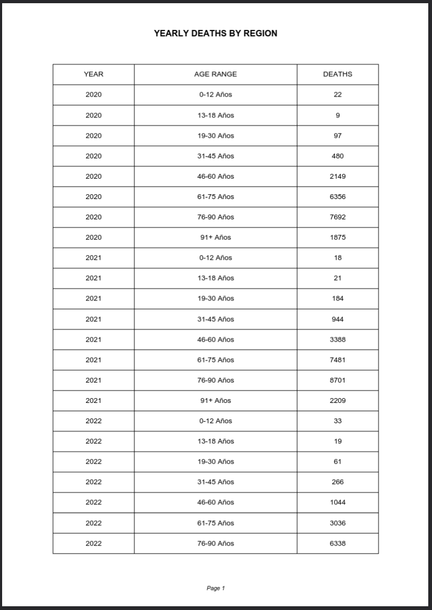

# 🦠 Chile COVID-19 Mortality Analysis (2020-2024)

### 📃 Description of the Project

This project focuses on analyzing **COVID-19** mortality data in **Chile** from **2020 to 2024**. With at least 60,000 records, the dataset provides critical insights into the impact of the pandemic on the population.  

# 📋 GoogleSheets

The project leverages **Python** for data processing and analysis and **Google Sheets** for collaborative data exploration.

## 🎯 Key objectives

- Cleaning and organizing the mortality dataset for meaningful analysis.
- Exploring trends and patterns, such as mortality rates by region, age, or time.
- Visualizing data to communicate insights effectively.
- Building reproducible workflows for data analysis and reporting.

## 🗄️ Data Dictionary 

| Nº | Variable Name | Description                                     | Data Type | Values                        |
|---|-------------------------|---------------------------------------------------|-----------|-------------------------------|
| 1 | AÑO | Year of the death date | Number | N/A |
| 2 | FECHA_DEF | Date of the death date | Date | N/A |
| 3 | SEXO | Gloss identifying biological sex | Number | 1: Male, 2: Female, 9: Other |
| 4 | EDAD_TIPO | Unit of age measurement | Number | 1: Years, 2: Months, 3: Days |
| 5 | EDAD_CANT | Numerical record of the patient's age at admission| Number | N/A |
| 6 | COD_COMUNA | Code of the commune of residence of the deceased, according to the political-administrative division updated in 2019| Number | N/A |
| 7 | COMUNA | Gloss of the commune of residence of the deceased, according to the political-administrative division updated in 2019 | Text | N/A |
| 8 | NOMBRE_REGION | Gloss of the region of residence| Text | N/A |
| 9 | DIAG1 | Basic cause of death | Text | N/A |
| 10 | CAPITULO_DIAG1 | ICD-10 chapter according to the cause of death | Text | N/A |
| 11 | GLOSA_CAPITULO_DIAG1 | Gloss of the ICD-10 chapter according to the cause of death | Text | N/A |
| 12 | CODIGO_GRUPO_DIAG1 | Group code of the cause of death according to ICD-10 | Text | N/A |
| 13 | GLOSA_GRUPO_DIAG1 | Gloss of the group code of the cause of death according to ICD-10 | Text | N/A |
| 14 | CODIGO_CATEGORIA_DIAG1 | Category code of the cause of death according to ICD-10 | Text | N/A |
| 15 | GLOSA_CATEGORIA_DIAG1  | Gloss code of the cause of death according to ICD-10 | Text | N/A |
| 16 | CODIGO_SUBCATEGORIA_DIAG1 | Category code of the cause of death according to ICD-10 | Text | N/A |
| 17 | GLOSA_SUBCATEGORIA_DIAG1 | Gloss of the category code of the cause of death according to ICD-10 | Text | N/A |
| 18 | DIAG2 | External cause of death | Text | N/A |
| 19 | CAPITULO_DIAG2 | ICD-10 chapter according to the cause of death | Text | N/A |
| 20 | GLOSA_CAPITULO_DIAG2 | Gloss of the ICD-10 chapter according to the cause of death | Text | N/A |
| 21 | CODIGO_GRUPO_DIAG2 | Group code of the cause of death according to ICD-10 | Text | N/A |
| 22 | GLOSA_GRUPO_DIAG2 | Gloss of the group code of the cause of death according to ICD-10 | Text | N/A |
| 23 | CODIGO_CATEGORIA_DIAG2 | Category code of the cause of death according to ICD-10 | Text | N/A |
| 24 | GLOSA_CATEGORIA_DIAG2 | Gloss of the category code of the cause of death according to ICD-10 | Text |N/A |
| 25 | CODIGO_SUBCATEGORIA_DIAG2 | Category code of the cause of death according to ICD-10 | Text | N/A |
| 26 | GLOSA_SUBCATEGORIA_DIAG2 | Gloss of the category code of the cause of death according to ICD-10 | Text | N/A |
| 27 | LUGAR_DEFUNCION | Describes the place where the death occurs | Text | N/A |

## ✨🗄️✨ Clean Data Dictionary 

| Nº | Variable Name | Description                                     | Data Type | Values                        |
|---|-------------------------|---------------------------------------------------|-----------|-------------------------------|
| 1 | AÑO | Year of the death date | Number | N/A |
| 2 | FECHA_DEF | Date of the death date | Date | N/A |
| 3 | SEXO_NOMBRE | Gloss identifying biological sex | Number | N/A |
| 4 | EDAD_CANT | Numerical record of the patient's age at admission| Number | N/A |
| 5 | COMUNA | Gloss of the commune of residence of the deceased, according to the political-administrative division updated in 2019 | Text | N/A |
| 6 | NOMBRE_REGION | Gloss of the region of residence| Text | N/A |
| 7 | LUGAR_DEFUNCION | Describes the place where the death occurs | Text | N/A |
| 8 | PERIODO | Period of the death date | Date | N/A |
| 9 | RANGO_ETARIO | Age range of the deceased | Text | N/A |

## 📊 Charts
### Month Deaths By Gender

## Yearly Deaths By Region

## Yearly Deaths By Age Range

## 📝 Download PDF

### Month Deaths By Gender

## Yearly Deaths By Region

## Yearly Deaths By Age Range

## 🔗 Important Links

- [Googlesheets Database](https://docs.google.com/spreadsheets/d/1Q0p_w4YwXYZFqseHEhs8AH_UoJY4ll8Vl4iryrIbMo8/edit?gid=1155343400#gid=1155343400)

# 🗄️ Postgres

The project leverages **Python** for data processing and analysis and **Postgres** for collaborative data exploration.
--
## 🎖️ Acknowledgments
The data used in this project, including COVID-19 mortality records in Chile from 2020 to 2024, is provided by the Chilean government’s open data platform:

- [Defunciones por COVID19](https://datos.gob.cl/dataset/defunciones-por-covid19)

Special thanks to **Pamela Suarez** ***(deis@minsal.cl)*** for creating and curating the dataset. I acknowledge and appreciate her work in making this information publicly accessible.

 

Thanks to the **Ministerio de Salud de Chile** and related governmental agencies for making this data publicly available.