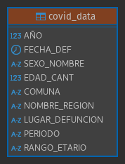
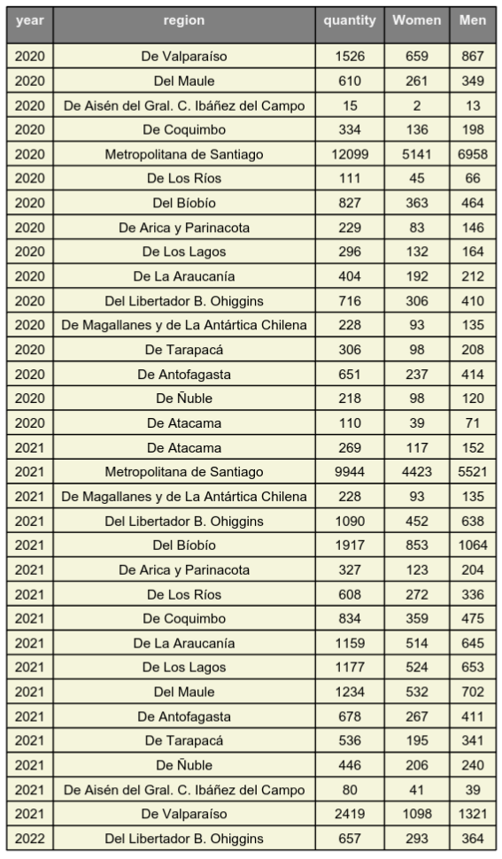
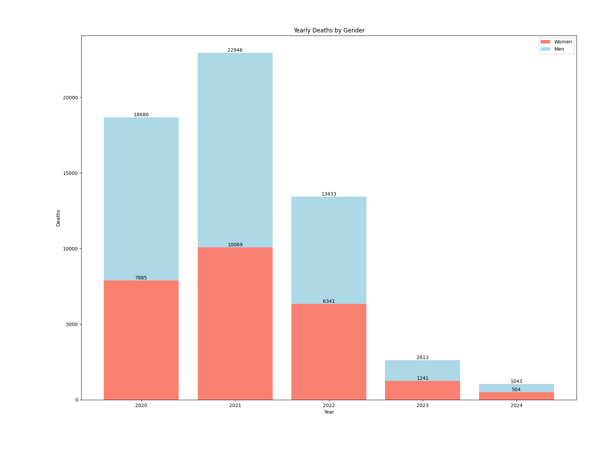
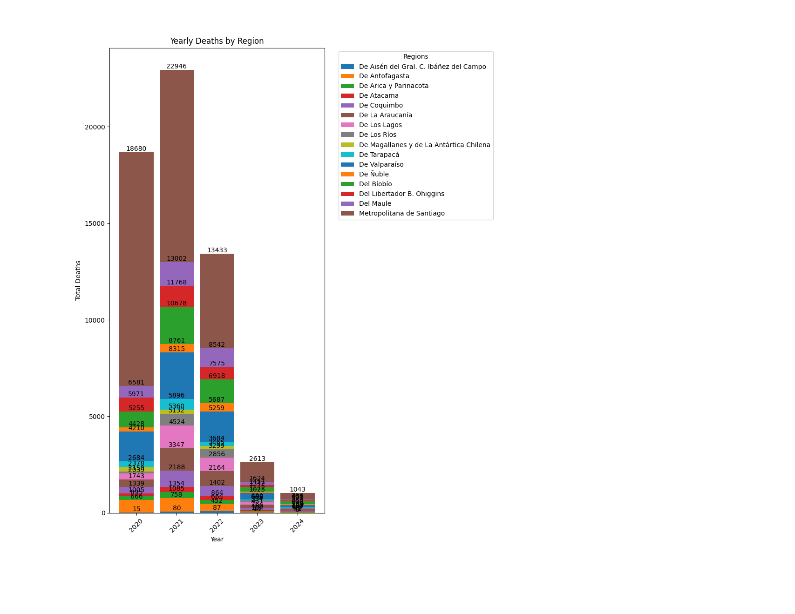
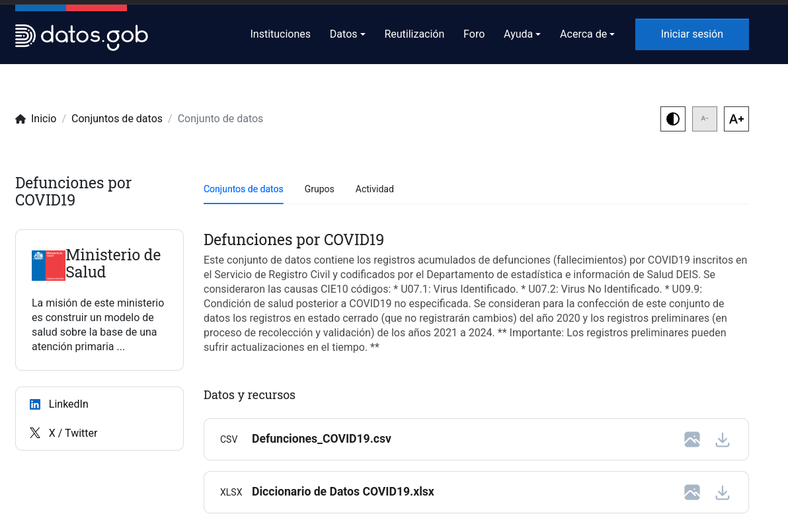

# 🦠 Chile COVID-19 Mortality Analysis (2020-2024)

### 📃 Project Description

- **Objective:** 
    - Analyze **COVID-19 mortality data in Chile from 2020 to 2024**, providing critical insights into the pandemic's impact on the population. 

- **Project Division:**
  - **First Part:** Work with **Google Sheets** for initial data exploration and analysis.
  - **Second Part:** Use **PostgreSQL** for advanced analysis and data storage.

- **Methodology:**

  - **Google Sheets:**
    - Use **Python** for data processing and analysis.
    - Collaboratively explore data using **Google Sheets**. 

  - **PostgreSQL:**
    - Migrate data to a **PostgreSQL** database for more detailed analysis and advanced queries.

- **Key Objectives:**
  - **Data Cleaning and Organization:** Prepare the mortality dataset for meaningful analysis.
  - **Exploration of Trends and Patterns:** Investigate mortality rates by region, age, and time.
  - **Data Visualization:** Create effective visualizations to communicate key findings.

---

# 📋 Google Sheets

The project leverages **Python** for data processing and analysis and **Google Sheets** for collaborative data exploration.

## 🎯 Key objectives

- **Cleaning** and **organizing** the mortality dataset for meaningful analysis.
- **Exploring** trends and patterns, such as mortality rates by region, age, or time.
- **Visualizing** data to communicate insights effectively.
- **Building** reproducible **workflows** for data analysis and **reporting**.

## 🗄️ Data Dictionary 

| Nº | Variable Name | Description                                     | Data Type | Values                        |
|---|-------------------------|---------------------------------------------------|-----------|-------------------------------|
| 1 | AÑO | Year of the death date | Number | N/A |
| 2 | FECHA_DEF | Date of the death date | Date | N/A |
| 3 | SEXO | Gloss identifying biological sex | Number | 1: Male, 2: Female, 9: Other |
| 4 | EDAD_TIPO | Unit of age measurement | Number | 1: Years, 2: Months, 3: Days |
| 5 | EDAD_CANT | Numerical record of the patient's age at admission| Number | N/A |
| 6 | COD_COMUNA | Code of the commune of residence of the deceased, according to the political-administrative division updated in 2019| Number | N/A |
| 7 | COMUNA | Gloss of the commune of residence of the deceased, according to the political-administrative division updated in 2019 | Text | N/A |
| 8 | NOMBRE_REGION | Gloss of the region of residence| Text | N/A |
| 9 | DIAG1 | Basic cause of death | Text | N/A |
| 10 | CAPITULO_DIAG1 | ICD-10 chapter according to the cause of death | Text | N/A |
| 11 | GLOSA_CAPITULO_DIAG1 | Gloss of the ICD-10 chapter according to the cause of death | Text | N/A |
| 12 | CODIGO_GRUPO_DIAG1 | Group code of the cause of death according to ICD-10 | Text | N/A |
| 13 | GLOSA_GRUPO_DIAG1 | Gloss of the group code of the cause of death according to ICD-10 | Text | N/A |
| 14 | CODIGO_CATEGORIA_DIAG1 | Category code of the cause of death according to ICD-10 | Text | N/A |
| 15 | GLOSA_CATEGORIA_DIAG1  | Gloss code of the cause of death according to ICD-10 | Text | N/A |
| 16 | CODIGO_SUBCATEGORIA_DIAG1 | Category code of the cause of death according to ICD-10 | Text | N/A |
| 17 | GLOSA_SUBCATEGORIA_DIAG1 | Gloss of the category code of the cause of death according to ICD-10 | Text | N/A |
| 18 | DIAG2 | External cause of death | Text | N/A |
| 19 | CAPITULO_DIAG2 | ICD-10 chapter according to the cause of death | Text | N/A |
| 20 | GLOSA_CAPITULO_DIAG2 | Gloss of the ICD-10 chapter according to the cause of death | Text | N/A |
| 21 | CODIGO_GRUPO_DIAG2 | Group code of the cause of death according to ICD-10 | Text | N/A |
| 22 | GLOSA_GRUPO_DIAG2 | Gloss of the group code of the cause of death according to ICD-10 | Text | N/A |
| 23 | CODIGO_CATEGORIA_DIAG2 | Category code of the cause of death according to ICD-10 | Text | N/A |
| 24 | GLOSA_CATEGORIA_DIAG2 | Gloss of the category code of the cause of death according to ICD-10 | Text |N/A |
| 25 | CODIGO_SUBCATEGORIA_DIAG2 | Category code of the cause of death according to ICD-10 | Text | N/A |
| 26 | GLOSA_SUBCATEGORIA_DIAG2 | Gloss of the category code of the cause of death according to ICD-10 | Text | N/A |
| 27 | LUGAR_DEFUNCION | Describes the place where the death occurs | Text | N/A |

## ✨🗄️✨ Clean Data Dictionary 

| Nº | Variable Name | Description                                     | Data Type | Values                        |
|---|-------------------------|---------------------------------------------------|-----------|-------------------------------|
| 1 | AÑO | Year of the death date | Number | N/A |
| 2 | FECHA_DEF | Date of the death date | Date | N/A |
| 3 | SEXO_NOMBRE | Gloss identifying biological sex | Number | N/A |
| 4 | EDAD_CANT | Numerical record of the patient's age at admission| Number | N/A |
| 5 | COMUNA | Gloss of the commune of residence of the deceased, according to the political-administrative division updated in 2019 | Text | N/A |
| 6 | NOMBRE_REGION | Gloss of the region of residence| Text | N/A |
| 7 | LUGAR_DEFUNCION | Describes the place where the death occurs | Text | N/A |
| 8 | PERIODO | Period of the death date | Date | N/A |
| 9 | RANGO_ETARIO | Age range of the deceased | Text | N/A |

## 📊 Charts
### Month Deaths By Gender


## Yearly Deaths By Region


## Yearly Deaths By Age Range


## 📝 Download PDF

### Month Deaths By Gender


## Yearly Deaths By Region


## Yearly Deaths By Age Range


## 🔗 Important Links

- [Googlesheets Database](https://docs.google.com/spreadsheets/d/1Q0p_w4YwXYZFqseHEhs8AH_UoJY4ll8Vl4iryrIbMo8/edit?gid=1155343400#gid=1155343400)

---

# 🗄️ Postgres

The project leverages **Python** for data processing and analysis and **Postgres** for collaborative data exploration.

## 🚀 Installation & Setup  

### Prerequisites  
Ensure you have the following installed:  
- **PostgreSQL** ([Download](https://www.postgresql.org/download/))  
- **Python 3.x** ([Download](https://www.python.org/downloads/))  
- **DBeaver** (optional, for database visualization: [Download](https://dbeaver.io/download/))
- **Required Python Libraries**:  

```
  pip install pandas scikit-learn psycopg2 matplotlib seaborn numpy reportlab fpdf googleapiclient google
```

## 🗄️ Database Schema

## Connection

1. In this case, we are going to use DBeaver, so the first thing we need to do is create a new connection.
- As shown in the picture, we need to configure the following settings:
    - **<u>Host</u>:** localhost
    - **<u>Database</u>:** postgres
    - **<u>Port</u>:** 5432
    - **<u>Username</u>:** postgres
    - **<u>Password</u>:** _YOUR PASSWORD_
<br>


2. After setting the parameters, we should test the connection to ensure it works before applying the configuration.

<br>


### 📌 Schema Diagram 



### `covid_data`
```
- AÑO (INT) - Year of the death date | Number
- FECHA_DEF (DATE) - Date of the death date 
- SEXO_NOMBRE (VARCHAR(10)) - Gloss identifying biological sex
- EDAD_CANT (INT) - Numerical record of the patient's age at admission
- COMUNA (VARCHAR(100)) - Gloss of the commune of residence of the deceased, according to the political-administrative division updated in 2019
- NOMBRE_REGION (VARCHAR(100)) - Gloss of the region of residence
- LUGAR_DEFUNCION (VARCHAR(100)) - Describes the place where the death occurs
- PERIODO (VARCHAR(7)) - Period of the death date
- RANGO_ETARIO (VARCHAR(20)) - Age range of the deceased
```

### ✍🏻 Insert Data from Terminal

- Since the data we have is quite large, we need to insert it through the terminal to avoid issues when using the editor.

```
psql -U postgres -d mi_base_de_datos -h localhost -p 5432 -f /home/usuario/Chile-COVID-Mortality-2020-2024/postgres/tables/add_into_tables.sql
```

## 🛠️ Example of a Query

```
select 
cd."AÑO" as "year",
cd."NOMBRE_REGION" as "region",
count(cd."EDAD_CANT") as "quantity",
sum(case when cd."SEXO_NOMBRE" = 'Mujer' then 1 else 0 end) as "Women",
sum(case when cd."SEXO_NOMBRE" = 'Hombre' then 1 else 0 end) as "Men"
from covid_chile.covid_data cd
group by "year", "region"
order by "year";
```

## 📊 Data Analysis

### Yearly Deaths by Gender and Region (PDF table)



### Yearly Deaths by Gender (Graphic)



### Yearly Deaths by Region (Graphic)



---

## 🎖️ Acknowledgments
The data used in this project, including COVID-19 mortality records in Chile from 2020 to 2024, is provided by the Chilean government’s open data platform:

- [Defunciones por COVID19](https://datos.gob.cl/dataset/defunciones-por-covid19)



Special thanks to **Pamela Suarez** ***(deis@minsal.cl)*** for creating and curating the dataset. I acknowledge and appreciate her work in making this information publicly accessible.

<br>

Thanks to the **Ministerio de Salud de Chile** and related governmental agencies for making this data publicly available.